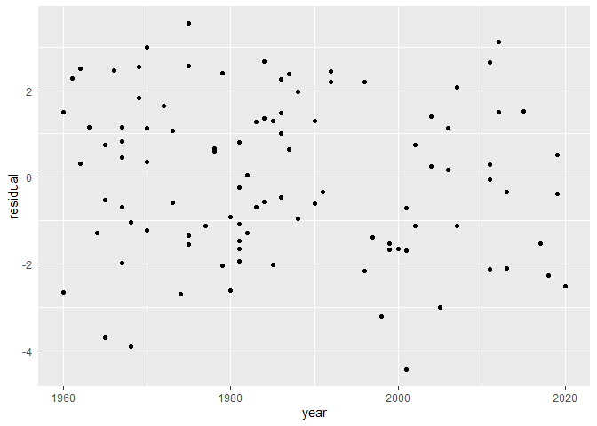
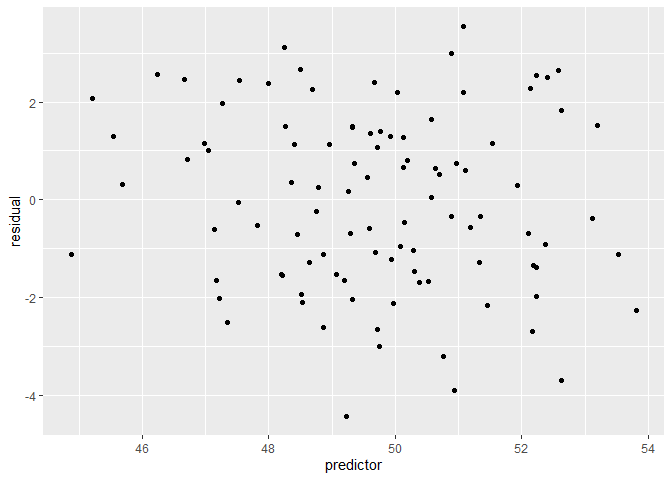
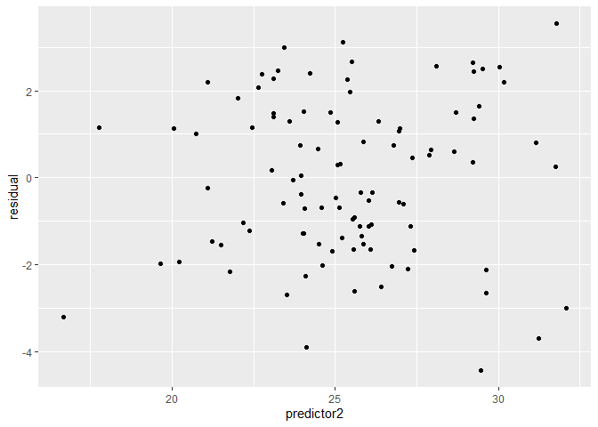
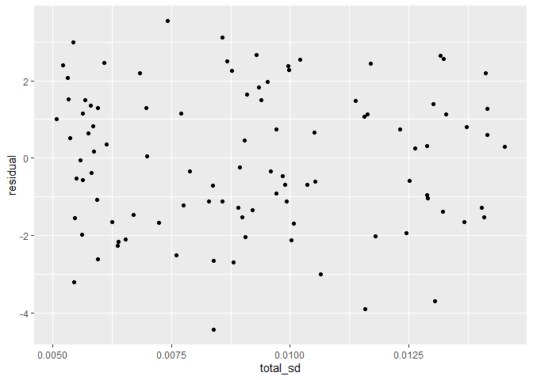

## Table of Contents
1. [Introduction](#intro)
2. [Residual tables](#2)
3. [Residual plots](#3)
4. [Coverage tables](#4)
5. [Statistics for multiple observations per group](#5)

## <a name="intro"></a>
## Introduction
rvalidate computes and presents validation statistics based on model results. All you need to do is set up a tibble composed of model results and observed data. This step is exemplified below. The package does the rest of the work. Validation statistics include residuals `rvalidate::residuals`, coverage `rvalidate::coverage`, and Probability integral transforms `rvalidate::pit`. We do not stylize the output of our functions. This can be customized based on user prefference with a package such as `kableExtra`

User input data should be formated as our simulated data `rvalidate::data`.

```r
library(rvalidate)
rv_data %>% head() %>% kableExtra::kable()
```

<table>
 <thead>
  <tr>
   <th style="text-align:left;"> country_code </th>
   <th style="text-align:left;"> region_code </th>
   <th style="text-align:right;"> year </th>
   <th style="text-align:left;"> source </th>
   <th style="text-align:right;"> y </th>
   <th style="text-align:right;"> predictor </th>
   <th style="text-align:right;"> predictor2 </th>
   <th style="text-align:right;"> total_sd </th>
   <th style="text-align:right;"> 2.5% </th>
   <th style="text-align:right;"> 10% </th>
   <th style="text-align:right;"> 50% </th>
   <th style="text-align:right;"> 90% </th>
   <th style="text-align:right;"> 97.5% </th>
  </tr>
 </thead>
<tbody>
  <tr>
   <td style="text-align:left;"> 489 </td>
   <td style="text-align:left;"> 500 </td>
   <td style="text-align:right;"> 1970 </td>
   <td style="text-align:left;"> DHS </td>
   <td style="text-align:right;"> 10.077963 </td>
   <td style="text-align:right;"> 48.36133 </td>
   <td style="text-align:right;"> 29.22361 </td>
   <td style="text-align:right;"> 0.0061271 </td>
   <td style="text-align:right;"> 7.862995 </td>
   <td style="text-align:right;"> 8.447235 </td>
   <td style="text-align:right;"> 9.726401 </td>
   <td style="text-align:right;"> 10.99915 </td>
   <td style="text-align:right;"> 11.73450 </td>
  </tr>
  <tr>
   <td style="text-align:left;"> 400 </td>
   <td style="text-align:left;"> 400 </td>
   <td style="text-align:right;"> 2019 </td>
   <td style="text-align:left;"> DHS </td>
   <td style="text-align:right;"> 10.027822 </td>
   <td style="text-align:right;"> 53.11009 </td>
   <td style="text-align:right;"> 23.95917 </td>
   <td style="text-align:right;"> 0.0058153 </td>
   <td style="text-align:right;"> 8.431334 </td>
   <td style="text-align:right;"> 9.134107 </td>
   <td style="text-align:right;"> 10.403559 </td>
   <td style="text-align:right;"> 11.72653 </td>
   <td style="text-align:right;"> 12.40965 </td>
  </tr>
  <tr>
   <td style="text-align:left;"> 489 </td>
   <td style="text-align:left;"> 500 </td>
   <td style="text-align:right;"> 1987 </td>
   <td style="text-align:left;"> DHS </td>
   <td style="text-align:right;"> 9.986056 </td>
   <td style="text-align:right;"> 50.63234 </td>
   <td style="text-align:right;"> 27.92385 </td>
   <td style="text-align:right;"> 0.0057448 </td>
   <td style="text-align:right;"> 7.450495 </td>
   <td style="text-align:right;"> 8.046995 </td>
   <td style="text-align:right;"> 9.349207 </td>
   <td style="text-align:right;"> 10.71551 </td>
   <td style="text-align:right;"> 11.49611 </td>
  </tr>
  <tr>
   <td style="text-align:left;"> 452 </td>
   <td style="text-align:left;"> 500 </td>
   <td style="text-align:right;"> 1990 </td>
   <td style="text-align:left;"> MCS </td>
   <td style="text-align:right;"> 9.945621 </td>
   <td style="text-align:right;"> 47.13831 </td>
   <td style="text-align:right;"> 27.10092 </td>
   <td style="text-align:right;"> 0.0105313 </td>
   <td style="text-align:right;"> 8.630393 </td>
   <td style="text-align:right;"> 9.286050 </td>
   <td style="text-align:right;"> 10.561890 </td>
   <td style="text-align:right;"> 11.94001 </td>
   <td style="text-align:right;"> 12.61043 </td>
  </tr>
  <tr>
   <td style="text-align:left;"> 489 </td>
   <td style="text-align:left;"> 500 </td>
   <td style="text-align:right;"> 1983 </td>
   <td style="text-align:left;"> DHS </td>
   <td style="text-align:right;"> 10.028415 </td>
   <td style="text-align:right;"> 52.10632 </td>
   <td style="text-align:right;"> 25.11941 </td>
   <td style="text-align:right;"> 0.0098908 </td>
   <td style="text-align:right;"> 8.812538 </td>
   <td style="text-align:right;"> 9.415039 </td>
   <td style="text-align:right;"> 10.714704 </td>
   <td style="text-align:right;"> 12.03304 </td>
   <td style="text-align:right;"> 12.65279 </td>
  </tr>
  <tr>
   <td style="text-align:left;"> 200 </td>
   <td style="text-align:left;"> 200 </td>
   <td style="text-align:right;"> 1981 </td>
   <td style="text-align:left;"> DHS </td>
   <td style="text-align:right;"> 10.119591 </td>
   <td style="text-align:right;"> 49.69058 </td>
   <td style="text-align:right;"> 26.10498 </td>
   <td style="text-align:right;"> 0.0059372 </td>
   <td style="text-align:right;"> 9.211838 </td>
   <td style="text-align:right;"> 9.857330 </td>
   <td style="text-align:right;"> 11.191985 </td>
   <td style="text-align:right;"> 12.46318 </td>
   <td style="text-align:right;"> 13.16903 </td>
  </tr>
</tbody>
</table>


## <a name="2"></a>
## residual tables
This function supports reporting of residual for subsets within the data. Subset arguement is NULL by default and will not report for subsets when unspecified.

```r
library(rvalidate)
residuals(data = rv_data,
           y = "y",
           yhat = "50%",
           total_standard_error = "total_sd") %>%
  kableExtra::kable() %>%
  kableExtra::column_spec(1, bold = T) %>%
  kableExtra::collapse_rows(columns = 1, valign = "top")
```

<table>
 <thead>
  <tr>
   <th style="text-align:left;"> residual </th>
   <th style="text-align:right;"> mean </th>
   <th style="text-align:right;"> mean_absolute </th>
   <th style="text-align:right;"> median </th>
   <th style="text-align:right;"> median_absolute </th>
  </tr>
 </thead>
<tbody>
  <tr>
   <td style="text-align:left;font-weight: bold;"> adjusted_residual </td>
   <td style="text-align:right;"> -0.0269716 </td>
   <td style="text-align:right;"> 1.5483442 </td>
   <td style="text-align:right;"> -0.0024625 </td>
   <td style="text-align:right;"> 1.4115883 </td>
  </tr>
  <tr>
   <td style="text-align:left;font-weight: bold;"> standardized_residual </td>
   <td style="text-align:right;"> -0.0148061 </td>
   <td style="text-align:right;"> 0.8512963 </td>
   <td style="text-align:right;"> -0.0013741 </td>
   <td style="text-align:right;"> 0.7729583 </td>
  </tr>
</tbody>
</table>


```r
residuals(data = rv_data,
           y = "y",
           yhat = "50%",
           total_standard_error = "total_sd",
           subset = "source")  %>%
  kableExtra::kable() %>%
  kableExtra::column_spec(1:2, bold = T) %>%
  kableExtra::collapse_rows(columns = 1, valign = "top")
```

<table>
 <thead>
  <tr>
   <th style="text-align:left;"> residual </th>
   <th style="text-align:left;"> source </th>
   <th style="text-align:right;"> mean </th>
   <th style="text-align:right;"> mean_absolute </th>
   <th style="text-align:right;"> median </th>
   <th style="text-align:right;"> median_absolute </th>
  </tr>
 </thead>
<tbody>
  <tr>
   <td style="text-align:left;font-weight: bold;vertical-align: top !important;" rowspan="2"> adjusted_residual </td>
   <td style="text-align:left;font-weight: bold;"> DHS </td>
   <td style="text-align:right;"> 0.1559647 </td>
   <td style="text-align:right;"> 1.5589203 </td>
   <td style="text-align:right;"> 0.2503714 </td>
   <td style="text-align:right;"> 1.5081795 </td>
  </tr>
  <tr>
   
   <td style="text-align:left;font-weight: bold;"> MCS </td>
   <td style="text-align:right;"> -0.3131027 </td>
   <td style="text-align:right;"> 1.5318021 </td>
   <td style="text-align:right;"> -0.6228278 </td>
   <td style="text-align:right;"> 1.3625398 </td>
  </tr>
  <tr>
   <td style="text-align:left;font-weight: bold;vertical-align: top !important;" rowspan="2"> residual </td>
   <td style="text-align:left;font-weight: bold;"> DHS </td>
   <td style="text-align:right;"> 0.1545700 </td>
   <td style="text-align:right;"> 1.5446905 </td>
   <td style="text-align:right;"> 0.2472091 </td>
   <td style="text-align:right;"> 1.4996168 </td>
  </tr>
  <tr>
   
   <td style="text-align:left;font-weight: bold;"> MCS </td>
   <td style="text-align:right;"> -0.3101850 </td>
   <td style="text-align:right;"> 1.5179353 </td>
   <td style="text-align:right;"> -0.6162686 </td>
   <td style="text-align:right;"> 1.3499942 </td>
  </tr>
  <tr>
   <td style="text-align:left;font-weight: bold;vertical-align: top !important;" rowspan="2"> standardized_residual </td>
   <td style="text-align:left;font-weight: bold;"> DHS </td>
   <td style="text-align:right;"> 0.0857646 </td>
   <td style="text-align:right;"> 0.8570859 </td>
   <td style="text-align:right;"> 0.1371663 </td>
   <td style="text-align:right;"> 0.8320764 </td>
  </tr>
  <tr>
   
   <td style="text-align:left;font-weight: bold;"> MCS </td>
   <td style="text-align:right;"> -0.1721090 </td>
   <td style="text-align:right;"> 0.8422406 </td>
   <td style="text-align:right;"> -0.3419424 </td>
   <td style="text-align:right;"> 0.7490569 </td>
  </tr>
</tbody>
</table>


```r
residuals(data = rv_data,
           y = "y",
           yhat = "50%",
           total_standard_error = "total_sd",
           subset = c("source", "region_code")) %>%
  kableExtra::kable() %>%
  kableExtra::column_spec(1:3, bold = T) %>%
  kableExtra::collapse_rows(columns = 1:2, valign = "top")
```

<table>
 <thead>
  <tr>
   <th style="text-align:left;"> residual </th>
   <th style="text-align:left;"> source </th>
   <th style="text-align:left;"> region_code </th>
   <th style="text-align:right;"> mean </th>
   <th style="text-align:right;"> mean_absolute </th>
   <th style="text-align:right;"> median </th>
   <th style="text-align:right;"> median_absolute </th>
  </tr>
 </thead>
<tbody>
  <tr>
   <td style="text-align:left;font-weight: bold;vertical-align: top !important;" rowspan="8"> adjusted_residual </td>
   <td style="text-align:left;font-weight: bold;vertical-align: top !important;" rowspan="4"> DHS </td>
   <td style="text-align:left;font-weight: bold;"> 100 </td>
   <td style="text-align:right;"> 0.1242832 </td>
   <td style="text-align:right;"> 1.9167098 </td>
   <td style="text-align:right;"> 0.1031835 </td>
   <td style="text-align:right;"> 2.2060872 </td>
  </tr>
  <tr>
   
   
   <td style="text-align:left;font-weight: bold;"> 200 </td>
   <td style="text-align:right;"> -0.0778244 </td>
   <td style="text-align:right;"> 1.8205981 </td>
   <td style="text-align:right;"> -0.5886859 </td>
   <td style="text-align:right;"> 1.8533339 </td>
  </tr>
  <tr>
   
   
   <td style="text-align:left;font-weight: bold;"> 400 </td>
   <td style="text-align:right;"> 0.6590630 </td>
   <td style="text-align:right;"> 1.2869985 </td>
   <td style="text-align:right;"> 0.9061045 </td>
   <td style="text-align:right;"> 1.1963463 </td>
  </tr>
  <tr>
   
   
   <td style="text-align:left;font-weight: bold;"> 500 </td>
   <td style="text-align:right;"> -0.0351205 </td>
   <td style="text-align:right;"> 1.4109159 </td>
   <td style="text-align:right;"> -0.1933217 </td>
   <td style="text-align:right;"> 1.4609951 </td>
  </tr>
  <tr>
   
   <td style="text-align:left;font-weight: bold;vertical-align: top !important;" rowspan="4"> MCS </td>
   <td style="text-align:left;font-weight: bold;"> 100 </td>
   <td style="text-align:right;"> -1.0362826 </td>
   <td style="text-align:right;"> 1.0362826 </td>
   <td style="text-align:right;"> -1.1040575 </td>
   <td style="text-align:right;"> 1.1040575 </td>
  </tr>
  <tr>
   
   
   <td style="text-align:left;font-weight: bold;"> 200 </td>
   <td style="text-align:right;"> 0.4917621 </td>
   <td style="text-align:right;"> 1.5108978 </td>
   <td style="text-align:right;"> 0.6084483 </td>
   <td style="text-align:right;"> 1.4574791 </td>
  </tr>
  <tr>
   
   
   <td style="text-align:left;font-weight: bold;"> 400 </td>
   <td style="text-align:right;"> -1.0616683 </td>
   <td style="text-align:right;"> 2.1178659 </td>
   <td style="text-align:right;"> -1.3444451 </td>
   <td style="text-align:right;"> 1.5461793 </td>
  </tr>
  <tr>
   
   
   <td style="text-align:left;font-weight: bold;"> 500 </td>
   <td style="text-align:right;"> -0.5908207 </td>
   <td style="text-align:right;"> 1.1380141 </td>
   <td style="text-align:right;"> -0.6228278 </td>
   <td style="text-align:right;"> 1.1217226 </td>
  </tr>
  <tr>
   <td style="text-align:left;font-weight: bold;vertical-align: top !important;" rowspan="8"> residual </td>
   <td style="text-align:left;font-weight: bold;vertical-align: top !important;" rowspan="4"> DHS </td>
   <td style="text-align:left;font-weight: bold;"> 100 </td>
   <td style="text-align:right;"> 0.1233103 </td>
   <td style="text-align:right;"> 1.8994906 </td>
   <td style="text-align:right;"> 0.1025558 </td>
   <td style="text-align:right;"> 2.1853966 </td>
  </tr>
  <tr>
   
   
   <td style="text-align:left;font-weight: bold;"> 200 </td>
   <td style="text-align:right;"> -0.0764925 </td>
   <td style="text-align:right;"> 1.8035728 </td>
   <td style="text-align:right;"> -0.5813193 </td>
   <td style="text-align:right;"> 1.8360161 </td>
  </tr>
  <tr>
   
   
   <td style="text-align:left;font-weight: bold;"> 400 </td>
   <td style="text-align:right;"> 0.6525885 </td>
   <td style="text-align:right;"> 1.2744776 </td>
   <td style="text-align:right;"> 0.8959477 </td>
   <td style="text-align:right;"> 1.1870997 </td>
  </tr>
  <tr>
   
   
   <td style="text-align:left;font-weight: bold;"> 500 </td>
   <td style="text-align:right;"> -0.0349376 </td>
   <td style="text-align:right;"> 1.3988907 </td>
   <td style="text-align:right;"> -0.1915564 </td>
   <td style="text-align:right;"> 1.4527866 </td>
  </tr>
  <tr>
   
   <td style="text-align:left;font-weight: bold;vertical-align: top !important;" rowspan="4"> MCS </td>
   <td style="text-align:left;font-weight: bold;"> 100 </td>
   <td style="text-align:right;"> -1.0255850 </td>
   <td style="text-align:right;"> 1.0255850 </td>
   <td style="text-align:right;"> -1.0905543 </td>
   <td style="text-align:right;"> 1.0905543 </td>
  </tr>
  <tr>
   
   
   <td style="text-align:left;font-weight: bold;"> 200 </td>
   <td style="text-align:right;"> 0.4874673 </td>
   <td style="text-align:right;"> 1.4970880 </td>
   <td style="text-align:right;"> 0.6017284 </td>
   <td style="text-align:right;"> 1.4411106 </td>
  </tr>
  <tr>
   
   
   <td style="text-align:left;font-weight: bold;"> 400 </td>
   <td style="text-align:right;"> -1.0510239 </td>
   <td style="text-align:right;"> 2.0983451 </td>
   <td style="text-align:right;"> -1.3287868 </td>
   <td style="text-align:right;"> 1.5311199 </td>
  </tr>
  <tr>
   
   
   <td style="text-align:left;font-weight: bold;"> 500 </td>
   <td style="text-align:right;"> -0.5871236 </td>
   <td style="text-align:right;"> 1.1289197 </td>
   <td style="text-align:right;"> -0.6162686 </td>
   <td style="text-align:right;"> 1.1105966 </td>
  </tr>
  <tr>
   <td style="text-align:left;font-weight: bold;vertical-align: top !important;" rowspan="8"> standardized_residual </td>
   <td style="text-align:left;font-weight: bold;vertical-align: top !important;" rowspan="4"> DHS </td>
   <td style="text-align:left;font-weight: bold;"> 100 </td>
   <td style="text-align:right;"> 0.0684199 </td>
   <td style="text-align:right;"> 1.0539501 </td>
   <td style="text-align:right;"> 0.0569041 </td>
   <td style="text-align:right;"> 1.2125877 </td>
  </tr>
  <tr>
   
   
   <td style="text-align:left;font-weight: bold;"> 200 </td>
   <td style="text-align:right;"> -0.0424426 </td>
   <td style="text-align:right;"> 1.0007292 </td>
   <td style="text-align:right;"> -0.3225504 </td>
   <td style="text-align:right;"> 1.0187307 </td>
  </tr>
  <tr>
   
   
   <td style="text-align:left;font-weight: bold;"> 400 </td>
   <td style="text-align:right;"> 0.3620948 </td>
   <td style="text-align:right;"> 0.7071558 </td>
   <td style="text-align:right;"> 0.4971250 </td>
   <td style="text-align:right;"> 0.6586734 </td>
  </tr>
  <tr>
   
   
   <td style="text-align:left;font-weight: bold;"> 500 </td>
   <td style="text-align:right;"> -0.0193855 </td>
   <td style="text-align:right;"> 0.7761876 </td>
   <td style="text-align:right;"> -0.1062869 </td>
   <td style="text-align:right;"> 0.8060922 </td>
  </tr>
  <tr>
   
   <td style="text-align:left;font-weight: bold;vertical-align: top !important;" rowspan="4"> MCS </td>
   <td style="text-align:left;font-weight: bold;"> 100 </td>
   <td style="text-align:right;"> -0.5690554 </td>
   <td style="text-align:right;"> 0.5690554 </td>
   <td style="text-align:right;"> -0.6051042 </td>
   <td style="text-align:right;"> 0.6051042 </td>
  </tr>
  <tr>
   
   
   <td style="text-align:left;font-weight: bold;"> 200 </td>
   <td style="text-align:right;"> 0.2704758 </td>
   <td style="text-align:right;"> 0.8306733 </td>
   <td style="text-align:right;"> 0.3338746 </td>
   <td style="text-align:right;"> 0.7996137 </td>
  </tr>
  <tr>
   
   
   <td style="text-align:left;font-weight: bold;"> 400 </td>
   <td style="text-align:right;"> -0.5831704 </td>
   <td style="text-align:right;"> 1.1642864 </td>
   <td style="text-align:right;"> -0.7372897 </td>
   <td style="text-align:right;"> 0.8495562 </td>
  </tr>
  <tr>
   
   
   <td style="text-align:left;font-weight: bold;"> 500 </td>
   <td style="text-align:right;"> -0.3257710 </td>
   <td style="text-align:right;"> 0.6263917 </td>
   <td style="text-align:right;"> -0.3419424 </td>
   <td style="text-align:right;"> 0.6162249 </td>
  </tr>
</tbody>
</table>


## <a name="3"></a>
## Residual plots

```r
residuals_autoplot(
  data = rv_data,
  y = "y",
  yhat = "50%"
)
```

```
## $year
```

<!-- -->

```
## 
## $predictor
```

<!-- -->

```
## 
## $predictor2
```

<!-- -->

```
## 
## $total_sd
```

<!-- -->


## <a name="4"></a>
## Coverage tables
If provided a subset column name, coverage will be calculate for each subset.

```r
coverage(data = rv_data,
         y = "y",
         lower = "2.5%",
         upper = "97.5%",
         subset = "source")  %>%
  kableExtra::kable() %>%
  kableExtra::column_spec(1, bold = T)
```

<table>
 <thead>
  <tr>
   <th style="text-align:left;"> source </th>
   <th style="text-align:right;"> coverage </th>
  </tr>
 </thead>
<tbody>
  <tr>
   <td style="text-align:left;font-weight: bold;"> DHS </td>
   <td style="text-align:right;"> 0.68 </td>
  </tr>
  <tr>
   <td style="text-align:left;font-weight: bold;"> MCS </td>
   <td style="text-align:right;"> 0.81 </td>
  </tr>
</tbody>
</table>

## <a name="5"></a>
## Statistics for data with multiple observations within a grouping
For data containing multiple observations per group (e.g. country-year you) we compute statistics for all unique permutations of the data where there is only one observation from each group in each permutation. Note the run time will increase substantially as the number of multiple observations increase.

### residual

```r
devtools::load_all()
```

```
## Loading rvalidate
```

```r
residuals_multiple(data = rv_data,
           y = "y",
           yhat = "50%",
           total_standard_error = "total_sd",
           subset = "source",
           group_to_check = c("country_code", "year"))  %>%
  kableExtra::kable() %>%
  kableExtra::column_spec(1:2, bold = T) %>%
  kableExtra::collapse_rows(columns = 1:2, valign = "top")
```

<table>
 <thead>
  <tr>
   <th style="text-align:left;"> residual </th>
   <th style="text-align:left;"> source </th>
   <th style="text-align:left;"> mean </th>
   <th style="text-align:left;"> mean_absolute </th>
   <th style="text-align:left;"> median </th>
   <th style="text-align:left;"> median_absolute </th>
  </tr>
 </thead>
<tbody>
  <tr>
   <td style="text-align:left;font-weight: bold;vertical-align: top !important;" rowspan="2"> adjusted_residual </td>
   <td style="text-align:left;font-weight: bold;"> DHS </td>
   <td style="text-align:left;"> 0.16 (0.0554) </td>
   <td style="text-align:left;"> 1.55 (0.0101) </td>
   <td style="text-align:left;"> 0.28 (0.1104) </td>
   <td style="text-align:left;"> 1.43 (0.0314) </td>
  </tr>
  <tr>
   
   <td style="text-align:left;font-weight: bold;"> MCS </td>
   <td style="text-align:left;"> -0.3 (0.0263) </td>
   <td style="text-align:left;"> 1.56 (0.0028) </td>
   <td style="text-align:left;"> -0.61 (0.0355) </td>
   <td style="text-align:left;"> 1.37 (0.0097) </td>
  </tr>
  <tr>
   <td style="text-align:left;font-weight: bold;vertical-align: top !important;" rowspan="2"> residual </td>
   <td style="text-align:left;font-weight: bold;"> DHS </td>
   <td style="text-align:left;"> 0.16 (0.0548) </td>
   <td style="text-align:left;"> 1.53 (0.01) </td>
   <td style="text-align:left;"> 0.27 (0.1099) </td>
   <td style="text-align:left;"> 1.41 (0.0307) </td>
  </tr>
  <tr>
   
   <td style="text-align:left;font-weight: bold;"> MCS </td>
   <td style="text-align:left;"> -0.3 (0.0261) </td>
   <td style="text-align:left;"> 1.54 (0.0027) </td>
   <td style="text-align:left;"> -0.61 (0.0339) </td>
   <td style="text-align:left;"> 1.36 (0.0082) </td>
  </tr>
  <tr>
   <td style="text-align:left;font-weight: bold;vertical-align: top !important;" rowspan="2"> standardized_residual </td>
   <td style="text-align:left;font-weight: bold;"> DHS </td>
   <td style="text-align:left;"> 0.09 (0.0301) </td>
   <td style="text-align:left;"> 0.85 (0.004) </td>
   <td style="text-align:left;"> 0.15 (0.0605) </td>
   <td style="text-align:left;"> 0.78 (0.0165) </td>
  </tr>
  <tr>
   
   <td style="text-align:left;font-weight: bold;"> MCS </td>
   <td style="text-align:left;"> -0.16 (0.0144) </td>
   <td style="text-align:left;"> 0.85 (0.0026) </td>
   <td style="text-align:left;"> -0.34 (0.0188) </td>
   <td style="text-align:left;"> 0.75 (0.0049) </td>
  </tr>
</tbody>
</table>

### Coverage

```r
coverage_multiple(data = rv_data,
         y = "y",
         lower = "2.5%",
         upper = "97.5%",
         subset = "source",
         group_to_check = c("country_code", "year"))  %>%
  kableExtra::kable() %>%
  kableExtra::column_spec(1, bold = T)
```

<table>
 <thead>
  <tr>
   <th style="text-align:left;"> source </th>
   <th style="text-align:left;"> coverage </th>
  </tr>
 </thead>
<tbody>
  <tr>
   <td style="text-align:left;font-weight: bold;"> DHS </td>
   <td style="text-align:left;"> 0.69 (0.0085) </td>
  </tr>
  <tr>
   <td style="text-align:left;font-weight: bold;"> MCS </td>
   <td style="text-align:left;"> 0.81 (0.0071) </td>
  </tr>
</tbody>
</table>
